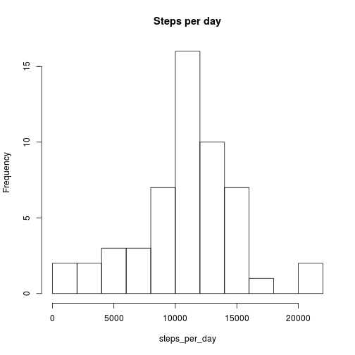
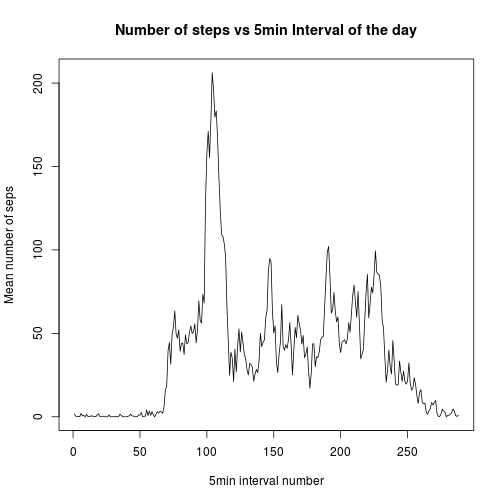
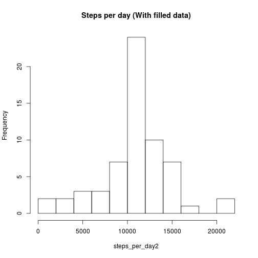
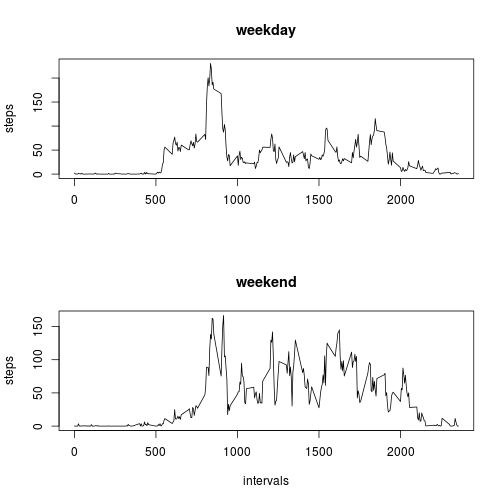

#1. Loading and preprocessing the data

Reading the data:

```r
setwd("/home/luis/repo/ReproductibleResearch/RR1/RepData_PeerAssessment1")
actdata <- read.csv("activity.csv")
```
With this we have a dataframe with the data. We will create an additional dataframe with clean data.

Cleaning the data:

```r
adc <- actdata[!is.na(actdata$steps),]
```
"adc" is a second dataframe which the rows with "NA" in the "steps" column had been removed.

#2. What is mean total number of steps taken per day?

We first calculate the sum of the steps taken each day with the tapply function.

Sum per date:

```r
steps_per_day <- tapply(actdata$steps,actdata$date,FUN = sum)
```

Following this, we plot an histogram showing the number of days with certains amount of steps taken (we use 10 boxes)

Histogram of steps per day (Number of days in which the x-axis amount of steps is done):

```r
hist(steps_per_day, breaks = 10, main = "Steps per day")
```

 

We can calculate the mean and the median of the total steps taken each day:

```r
mean(steps_per_day[!is.na(steps_per_day)])
```

```
## [1] 10766.19
```

```r
median(steps_per_day[!is.na(steps_per_day)])
```

```
## [1] 10765
```
As we can see the mean of the total steps is 10766 and the median 10765. The values are very close.

#3. What is the average daily activity pattern?

Calculating and plotting the mean steps for each 5 minutes interval of the day, using again tapply and the basic plot system.

```r
mean_steps <- tapply(adc$steps,adc$interval,FUN = mean)
maint = "Number of steps vs 5min Interval of the day"
ylabt = "Mean number of seps"
xlabt = "5min interval number"
plot(mean_steps,type = "l", main = maint, ylab = ylabt, xlab = xlabt)
```

 

We can see that the interval with higher mean steps is at 8:35 (index 104)

```r
which.max(mean_steps)
```

```
## 835 
## 104
```
With a mean value over 206

```r
max(mean_steps)
```

```
## [1] 206.1698
```


#4. Imputing missing values

We can calculate the number of rows with NA, substracting the number of rows of the clean dataframe from the number of row of the original dataframe.

```r
dim(actdata)[1] - dim(adc)[1]
```

```
## [1] 2304
```
The number of "NA" in the steps column is 2304.

We will fill the missing "NA" values in the original dataframe, and we are going to do it using the mean value for that interval.

```r
actdata2 <- actdata
#dummy <- as.vector(mean_steps)
for (i in 1:dim(actdata2)[1]) {
  #print(i)
  if (is.na(actdata2$steps[i])) {
    #print(actdata2$interval[i]/5)
    #print(dummy[(actdata2$interval[i]/5)+1])
    actdata2$steps[i] <- as.vector(mean_steps[as.character(actdata2$interval[i])])
  }
}
```

We proceed to calculate the new histogram

```r
steps_per_day2 <- tapply(actdata2$steps,actdata2$date,FUN = sum)
hist(steps_per_day2, breaks = 10, main = "Steps per day (With filled data)")
```

 

And the new mean and median

```r
mean(steps_per_day2[!is.na(steps_per_day2)])
```

```
## [1] 10766.19
```

```r
median(steps_per_day2[!is.na(steps_per_day2)])
```

```
## [1] 10766.19
```
The news values are 10766.19 and 10766.19. Which, as we can see:

```r
mea1 <- mean(steps_per_day[!is.na(steps_per_day)])
med1 <- median(steps_per_day[!is.na(steps_per_day)])
mea2 <- mean(steps_per_day2[!is.na(steps_per_day2)])
med2 <- median(steps_per_day2[!is.na(steps_per_day2)])
mea2-mea1
```

```
## [1] 0
```

```r
med2-med1
```

```
## [1] 1.188679
```
in the case of the mean is exactly the same as the originals, with a slight difference in the median, due to the way we decide to replace the "NA" values.

Here we can see the difference in steps-per-day between the two datasets

```r
steps_per_day2 - steps_per_day
```

```
## 2012-10-01 2012-10-02 2012-10-03 2012-10-04 2012-10-05 2012-10-06 
##         NA          0          0          0          0          0 
## 2012-10-07 2012-10-08 2012-10-09 2012-10-10 2012-10-11 2012-10-12 
##          0         NA          0          0          0          0 
## 2012-10-13 2012-10-14 2012-10-15 2012-10-16 2012-10-17 2012-10-18 
##          0          0          0          0          0          0 
## 2012-10-19 2012-10-20 2012-10-21 2012-10-22 2012-10-23 2012-10-24 
##          0          0          0          0          0          0 
## 2012-10-25 2012-10-26 2012-10-27 2012-10-28 2012-10-29 2012-10-30 
##          0          0          0          0          0          0 
## 2012-10-31 2012-11-01 2012-11-02 2012-11-03 2012-11-04 2012-11-05 
##          0         NA          0          0         NA          0 
## 2012-11-06 2012-11-07 2012-11-08 2012-11-09 2012-11-10 2012-11-11 
##          0          0          0         NA         NA          0 
## 2012-11-12 2012-11-13 2012-11-14 2012-11-15 2012-11-16 2012-11-17 
##          0          0         NA          0          0          0 
## 2012-11-18 2012-11-19 2012-11-20 2012-11-21 2012-11-22 2012-11-23 
##          0          0          0          0          0          0 
## 2012-11-24 2012-11-25 2012-11-26 2012-11-27 2012-11-28 2012-11-29 
##          0          0          0          0          0          0 
## 2012-11-30 
##         NA
```
The only difference is the steps added in the missing value days:

```r
steps_per_day2[is.na(steps_per_day)]
```

```
## 2012-10-01 2012-10-08 2012-11-01 2012-11-04 2012-11-09 2012-11-10 
##   10766.19   10766.19   10766.19   10766.19   10766.19   10766.19 
## 2012-11-14 2012-11-30 
##   10766.19   10766.19
```

#5. Are there differences in activity patterns between weekdays and weekends?

Adding a new column classifying the dates between "weekdays" and "weekend"

```r
myfunction <- function(ddate){
if (weekdays(as.Date(ddate)) == "zaterdag" | weekdays(as.Date(ddate)) == "zondag"){
  return("weekend")
} else {
  return("weekday")
}  
}

actdata2$daytype <- apply(actdata2,1,function(row) myfunction(row[2]))
```

And plotting:


```r
intervals <- actdata$interval[actdata$date == "2012-11-04"]
mswd <- tapply(actdata2$steps[actdata2$daytype == "weekday"],actdata2$interval[actdata2$daytype == "weekday"],FUN = mean)
mswe <- tapply(actdata2$steps[actdata2$daytype == "weekend"],actdata2$interval[actdata2$daytype == "weekend"],FUN = mean)

layout(c(1,2))
plot(intervals,mswd,type = "l",main = "weekday",ylab = "steps",xlab = "")
plot(intervals,mswe,type = "l",main = "weekend",ylab = "steps")
```

 


